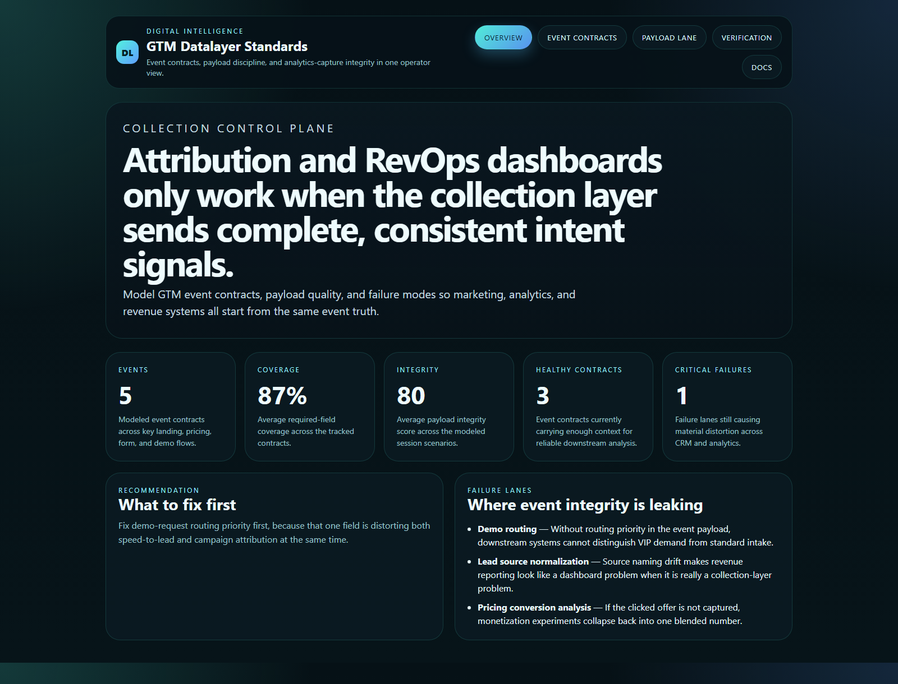
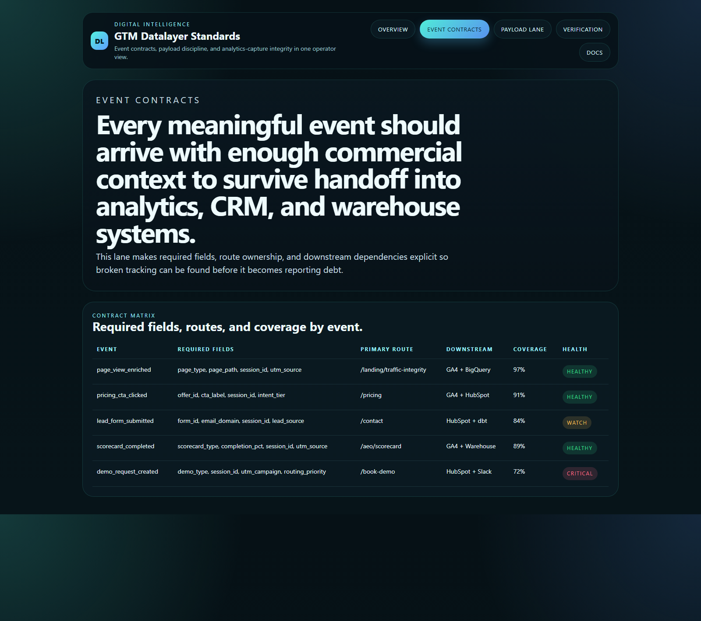
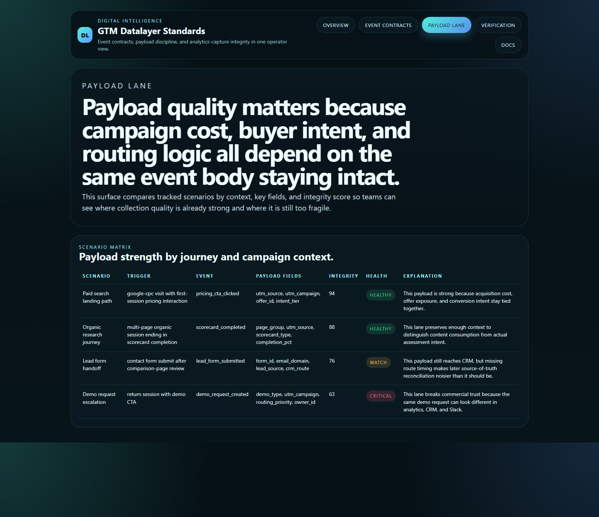
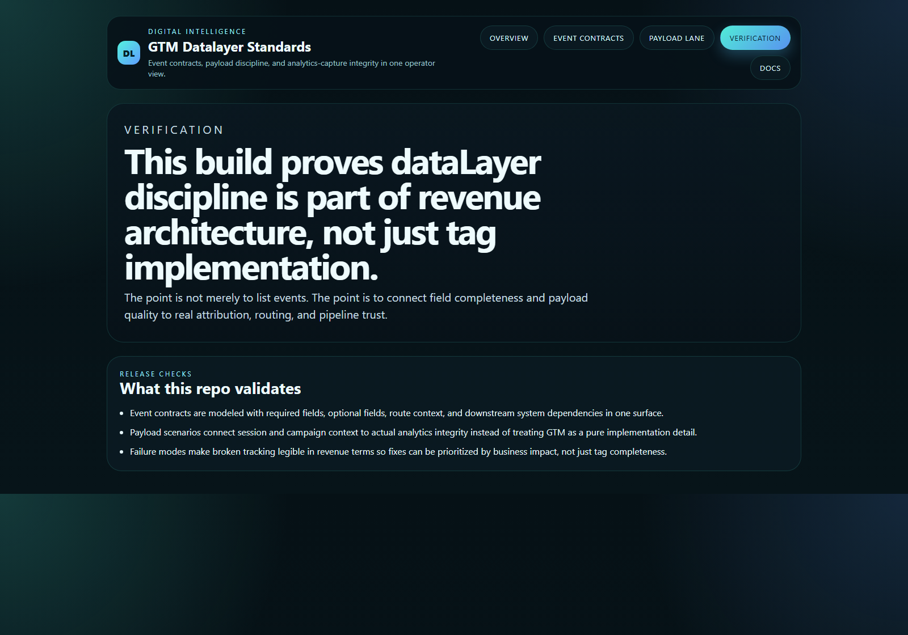

# GTM Datalayer Standards

TypeScript control plane for governing GTM `dataLayer` event contracts, payload discipline, and analytics-capture integrity.

## Why this exists

Attribution quality usually breaks long before dashboards admit it:
- the event fires, but the commercial context is incomplete
- routing metadata lands in CRM but never reaches analytics
- pricing and demo events lose offer identity on the way downstream
- teams debug “reporting problems” that really started in collection

`gtm-datalayer-standards` keeps those dynamics visible in one operator-facing surface so Growth, Analytics, and RevOps teams can standardize the event layer before revenue reporting gets noisy.

## Routes

- `/`
- `/event-contracts`
- `/payload-lane`
- `/verification`
- `/docs`

## API

- `/api/dashboard/summary`
- `/api/event-contracts`
- `/api/payload-lane`
- `/api/failure-modes`
- `/api/verification`
- `/api/sample`

## Screenshots






## Local Development

```powershell
cd gtm-datalayer-standards
npm install
npm run dev
```

Open:
- [http://127.0.0.1:5322/](http://127.0.0.1:5322/)
- [http://127.0.0.1:5322/event-contracts](http://127.0.0.1:5322/event-contracts)
- [http://127.0.0.1:5322/payload-lane](http://127.0.0.1:5322/payload-lane)
- [http://127.0.0.1:5322/verification](http://127.0.0.1:5322/verification)
- [http://127.0.0.1:5322/docs](http://127.0.0.1:5322/docs)

## Validation

- `npm run build`
- `npm run test`
- `npm run demo`
- `npm run smoke`
- `npm run render:assets`

## Docs

- [Architecture](./docs/architecture.md)
- [Origin](./docs/ORIGIN.md)
- [Changelog](./CHANGELOG.md)
